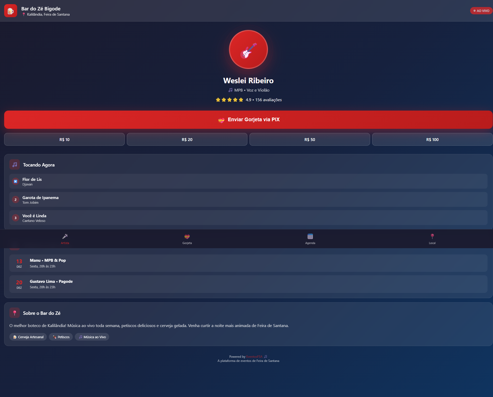

# 📚 EventosFSA - Índice Master de Documentação

<div align="center">


**Guia Completo de Navegação para Todos os Materiais**

*Versão 1.0 | Feira de Santana, Bahia*

</div>

---

## 🎯 Para o Carlos: Por Onde Começar?

Olá Carlos! Este índice organiza **tudo** que você precisa para entender e apresentar o EventosFSA.

### 🚦 Ordem Recomendada de Leitura

| # | Material | O que você vai aprender | Tempo |
|---|----------|------------------------|-------|
| **1º** | [📖 Book 1: Visão Geral](books/01-visao-geral/book.pdf) | O que é, pra quem é, como funciona | 10 min |
| **2º** | [📖 Book 5: Modelo de Negócio](books/05-modelo-negocio/book.pdf) | Como ganhamos dinheiro, investimento, projeções | 15 min |
| **3º** | [📖 Book 2: Guia Estabelecimentos](books/02-guia-estabelecimentos/book.pdf) | Como bares e restaurantes usam | 10 min |
| **4º** | [📖 Book 3: Guia Artistas](books/03-guia-artistas/book.pdf) | Como artistas usam | 10 min |
| **5º** | [📖 Book 4: Infraestrutura QR Code](books/04-infraestrutura-qrcode/book.pdf) | Parte técnica simplificada | 8 min |

---

## 📂 Estrutura Completa dos Arquivos

```
Cliente-Carlos/
│
├── 📄 README.md                    ← Visão geral do sistema
├── 📄 INDICE-MASTER.md             ← VOCÊ ESTÁ AQUI
│
├── 📁 books/                       ← 5 Books em PDF
│   │
│   ├── 📁 01-visao-geral/
│   │   ├── book.md                 ← Fonte (Markdown)
│   │   └── book.pdf                ← 📕 LEIA ESTE
│   │
│   ├── 📁 02-guia-estabelecimentos/
│   │   ├── book.md
│   │   └── book.pdf                ← 📗 LEIA ESTE
│   │
│   ├── 📁 03-guia-artistas/
│   │   ├── book.md
│   │   └── book.pdf                ← 📘 LEIA ESTE
│   │
│   ├── 📁 04-infraestrutura-qrcode/
│   │   ├── book.md
│   │   └── book.pdf                ← 📙 LEIA ESTE
│   │
│   └── 📁 05-modelo-negocio/
│       ├── book.md
│       └── book.pdf                ← 📓 LEIA ESTE
│
├── 📁 screenshots/                 ← 11 Imagens do Sistema
│   ├── 01-homepage.png
│   ├── 02-login.png
│   ├── 03-cadastro.png
│   ├── 04-eventos.png
│   ├── 05-artistas.png
│   ├── 06-estabelecimentos.png
│   ├── 07-admin-dashboard.png
│   ├── 08-artista-dashboard.png
│   ├── 09-estabelecimento-dashboard.png
│   ├── 10-artista-perfil.png
│   └── 11-portal-qrcode.png        ← NOVA! Interface do cliente no bar
│
└── 📁 assets/                      ← Logos e materiais gráficos
```

---

## 📕 Book 1: Visão Geral do EventosFSA

**Arquivo:** [books/01-visao-geral/book.pdf](books/01-visao-geral/book.pdf)

### O que tem neste book:
- ✅ O que é o EventosFSA
- ✅ Problema que resolvemos
- ✅ Nossa solução
- ✅ Público-alvo (artistas, bares, público)
- ✅ Funcionalidades principais
- ✅ Visão de futuro

### Ideal para:
👉 Primeira apresentação a investidores  
👉 Explicar o projeto para parceiros  
👉 Entender o conceito geral

---

## 📗 Book 2: Guia para Estabelecimentos

**Arquivo:** [books/02-guia-estabelecimentos/book.pdf](books/02-guia-estabelecimentos/book.pdf)

### O que tem neste book:
- ✅ Passo a passo de cadastro
- ✅ Como contratar artistas
- ✅ Gestão de eventos
- ✅ Sistema de avaliações
- ✅ QR Code no estabelecimento
- ✅ Dashboard do dono do bar

### Ideal para:
👉 Apresentar para donos de bares  
👉 Treinar funcionários de estabelecimentos  
👉 Material de vendas para prospecção

---

## 📘 Book 3: Guia para Artistas

**Arquivo:** [books/03-guia-artistas/book.pdf](books/03-guia-artistas/book.pdf)

### O que tem neste book:
- ✅ Como criar perfil profissional
- ✅ Sistema de gorjetas (recebe 100%)
- ✅ Ranking por estilo musical
- ✅ Receber e negociar propostas
- ✅ Gerenciar agenda de shows
- ✅ Dicas para crescer na plataforma

### Ideal para:
👉 Convencer artistas a se cadastrarem  
👉 Material de boas-vindas para novos artistas  
👉 Treinamento da equipe de suporte

---

## 📙 Book 4: Infraestrutura QR Code

**Arquivo:** [books/04-infraestrutura-qrcode/book.pdf](books/04-infraestrutura-qrcode/book.pdf)

### O que tem neste book:
- ✅ Como funciona o QR Code
- ✅ Fluxo do cliente no bar
- ✅ Integração com Wi-Fi
- ✅ Material de impressão
- ✅ Portal do cliente (nova interface!)
- ✅ Gorjetas via PIX

### Ideal para:
👉 Equipe técnica  
👉 Parceiros de infraestrutura  
👉 Entender o diferencial tecnológico

---

## 📓 Book 5: Modelo de Negócio

**Arquivo:** [books/05-modelo-negocio/book.pdf](books/05-modelo-negocio/book.pdf)

### O que tem neste book:
- ✅ Fontes de receita
- ✅ Estrutura de custos
- ✅ Projeções financeiras (1 a 3 anos)
- ✅ Investimento necessário
- ✅ ROI esperado
- ✅ Roadmap de desenvolvimento

### Ideal para:
👉 Apresentação para investidores  
👉 Planejamento estratégico  
👉 Decisões de investimento

---

## 🖼️ Galeria de Screenshots

### Interfaces Públicas

| Screenshot | Descrição |
|------------|-----------|
|  | **Homepage** - Página inicial com eventos destaque |
|  | **Eventos** - Lista de todos os eventos da cidade |
|  | **Artistas** - Catálogo com ranking e gorjetas |
|  | **Bares** - Lista de locais com música ao vivo |

### Interfaces de Login/Cadastro

| Screenshot | Descrição |
|------------|-----------|
|  | **Login** - Acesso ao sistema |
|  | **Cadastro** - Formulário inteligente |

### Dashboards (Áreas Logadas)

| Screenshot | Descrição |
|------------|-----------|
|  | **Admin** - Painel administrativo completo |
|  | **Artista** - Área do artista |
|  | **Bar/Restaurante** - Painel do dono |

### Páginas de Perfil

| Screenshot | Descrição |
|------------|-----------|
|  | **Perfil Artista** - Página pública completa |
|  | **Portal QR** - O que o cliente vê no bar! |

---

## 🎯 Casos de Uso: Qual Material Usar?

### Cenário 1: Reunião com Investidor
1. Comece com **Book 1** (visão geral)
2. Vá para **Book 5** (modelo de negócio)
3. Mostre screenshots do **Admin Dashboard**

### Cenário 2: Prospecção de Bar/Restaurante
1. Mostre **Book 2** (guia estabelecimentos)
2. Destaque o screenshot do **Portal QR Code**
3. Explique como aumenta engajamento

### Cenário 3: Recrutar Artistas
1. Use **Book 3** (guia artistas)
2. Mostre **Dashboard do Artista**
3. Enfatize gorjetas 100% e ranking

### Cenário 4: Apresentação Técnica
1. **Book 4** (infraestrutura)
2. Mostre **Portal QR Code**
3. Explique integração Wi-Fi

---

## 📊 Resumo Executivo Rápido

### O que é o EventosFSA?
> Plataforma que conecta artistas, bares e público de Feira de Santana através de música ao vivo + tecnologia.

### Como ganhamos dinheiro?
> 5% de comissão sobre cachês pagos via plataforma + planos premium.

### Qual o investimento inicial?
> ~R$ 15.000 para MVP + 3 meses de operação.

### Qual a projeção de receita?
> R$ 11.000/mês com 50 estabelecimentos ativos (6 meses).

### Qual o diferencial?
> QR Code integrado nos bares + Sistema de gorjetas + Ranking de artistas.

---

## 📞 Próximos Passos

Depois de ler os materiais, o Carlos pode:

1. **Validar o conceito** com donos de bar conhecidos
2. **Conversar com artistas** sobre interesse
3. **Decidir investimento** baseado no Book 5
4. **Agendar demonstração** do sistema funcionando

---

<div align="center">

**EventosFSA** - Alavancar os eventos de Feira de Santana 🎵

*Documentação gerada automaticamente pelo DevSan*


</div>
