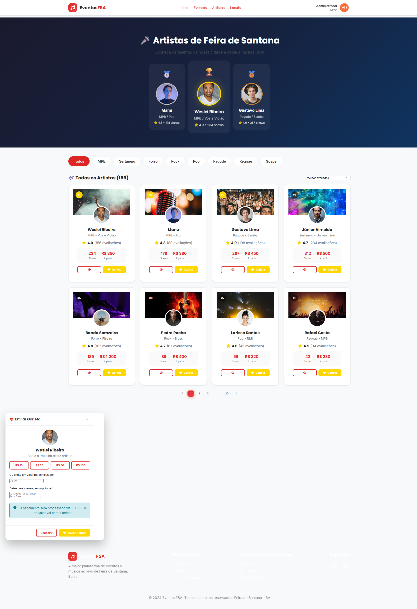
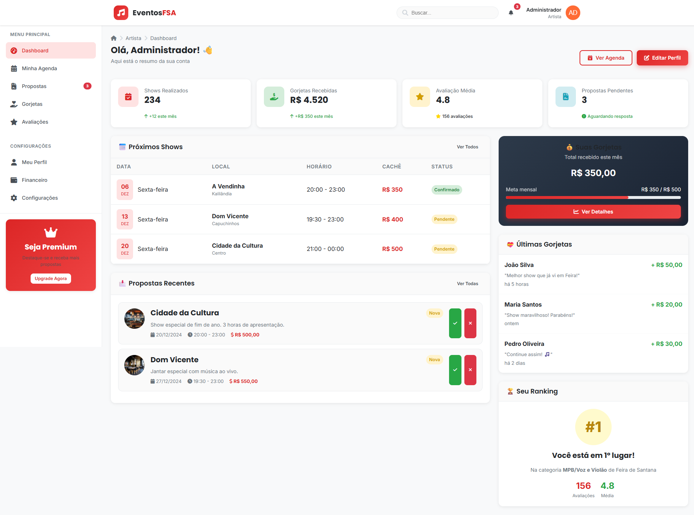
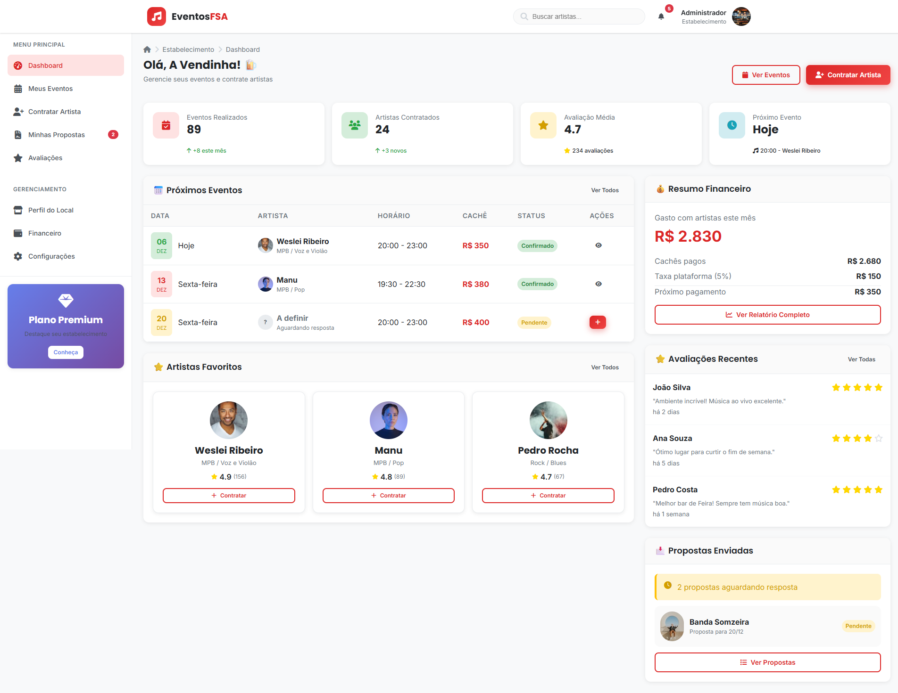
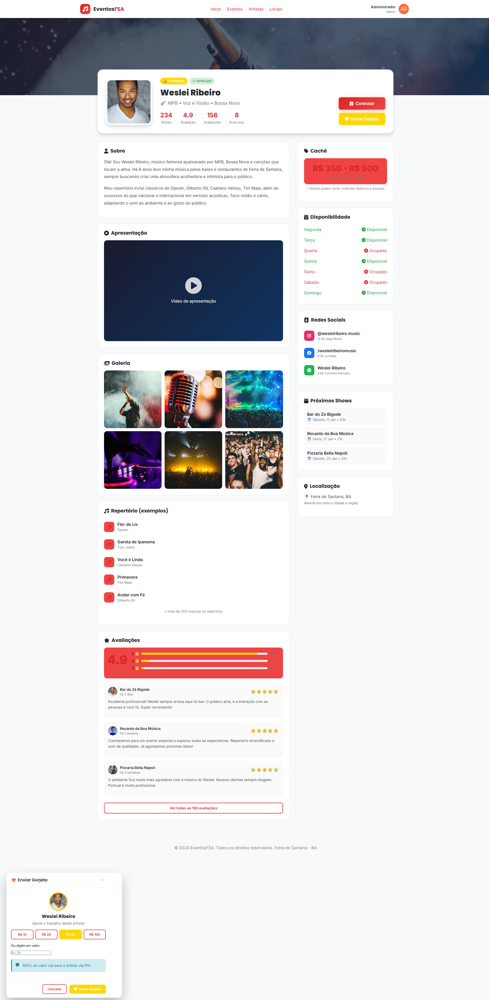

# 🎵 EventosFSA - Demonstrativo do Sistema

<div align="center">


**A maior plataforma de eventos e música ao vivo de Feira de Santana, Bahia** 🇧🇷

</div>

---

## 📋 Sumário

- [Visão Geral](#-visão-geral)
- [Funcionalidades](#-funcionalidades-principais)
- [Screenshots do Sistema](#-screenshots-do-sistema)
- [Arquitetura QR Code](#-arquitetura-qr-code)
- [Tipos de Usuários](#-tipos-de-usuários)
- [Modelo de Negócio](#-modelo-de-negócio)
- [Tecnologias](#-tecnologias-utilizadas)
- [Próximos Passos](#-próximos-passos)

---

## 🎯 Visão Geral

O **EventosFSA** é uma plataforma SaaS que conecta:

- 🎤 **Artistas locais** que buscam oportunidades de shows
- 🍺 **Bares, restaurantes e casas de show** que precisam de música ao vivo
- 👥 **Público** que quer descobrir onde tem evento hoje

### 💡 O Conceito

> *"Alavancar os eventos de Feira de Santana através de tecnologia, conectando talentos locais com estabelecimentos e criando uma cultura de música ao vivo mais forte na cidade."*

---

## 🚀 Funcionalidades Principais

### Para o **Público**
| Funcionalidade | Descrição |
|----------------|-----------|
| 📅 Agenda de Eventos | Veja todos os eventos com música ao vivo da cidade |
| 🎤 Ranking de Artistas | Descubra os melhores artistas por avaliação |
| 📍 Mapa de Locais | Encontre bares e restaurantes com música no seu bairro |
| 💝 Sistema de Gorjetas | Apoie seu artista favorito via PIX |
| 🔔 Notificações | Receba alertas de eventos do seu interesse |

### Para **Artistas**
| Funcionalidade | Descrição |
|----------------|-----------|
| 📱 Perfil Completo | Galeria, vídeos, repertório e redes sociais |
| 📩 Propostas de Shows | Receba convites de estabelecimentos |
| 💰 Receba Gorjetas | 100% do valor vai direto para o artista |
| ⭐ Avaliações | Construa sua reputação na plataforma |
| 🏆 Ranking | Destaque-se como o melhor do seu estilo |
| 📊 Dashboard | Acompanhe shows, ganhos e métricas |

### Para **Estabelecimentos**
| Funcionalidade | Descrição |
|----------------|-----------|
| 🎯 Contrate Artistas | Busque por estilo, cachê e disponibilidade |
| 📅 Gerencie Eventos | Calendário completo de apresentações |
| 💳 Pagamento Seguro | Cachê pago via plataforma com taxa de 5% |
| ⭐ Avaliações | Receba feedback dos clientes |
| 📢 Divulgação | Seus eventos aparecem para toda a cidade |

### Para **Administradores**
| Funcionalidade | Descrição |
|----------------|-----------|
| 🛡️ Painel Completo | Métricas, usuários, eventos e finanças |
| ✅ Aprovações | Validação de cadastros de artistas e estabelecimentos |
| 📊 Relatórios | Exportação de dados e análises |
| 💰 Financeiro | Controle de comissões e taxas |
| 🚨 Denúncias | Moderação de conteúdo |

---

## 📸 Screenshots do Sistema

### 🏠 Homepage (Página Inicial)

> Página principal mostrando eventos em destaque, artistas populares e bares com música ao vivo hoje.

---

### 🔐 Tela de Login

> Login com e-mail/senha ou redes sociais (Google, Facebook). Modo demo com acesso rápido para apresentação.

---

### 📝 Cadastro de Usuários

> Formulário inteligente que adapta os campos conforme o tipo: Usuário, Artista ou Estabelecimento. Inclui seleção de bairro de Feira de Santana.

---

### 📅 Lista de Eventos

> Todos os eventos da cidade com filtros por data, bairro e estilo musical. Cards informativos com artista, local e horário.

---

### 🎤 Catálogo de Artistas

> Ranking de artistas por avaliação. Sistema de gorjetas via PIX. Filtros por estilo musical (MPB, Sertanejo, Forró, Rock, etc).

---

### 🍺 Bares e Restaurantes

> Lista de locais com música ao vivo. Badge "Ao Vivo Agora" para quem está tocando. Tipos: Bar, Restaurante, Pub, Choperia, Hamburgueria, Pizzaria.

---

### 🛡️ Dashboard Administrativo

> Painel completo com métricas em tempo real: receita, usuários, eventos. Aprovação de cadastros e gestão financeira.

---

### 🎸 Dashboard do Artista

> Área do artista com agenda de shows, propostas recebidas, gorjetas acumuladas e ranking no estilo musical.

---

### 🏢 Dashboard do Estabelecimento

> Painel do bar/restaurante com eventos agendados, artistas favoritos, resumo financeiro e avaliações recebidas.

---

### 👤 Perfil Completo do Artista

> Página pública do artista com: foto, vídeo de apresentação, galeria, repertório, avaliações, disponibilidade, cachê e próximos shows.

---

## 📱 Arquitetura QR Code

### 🔗 Como Funciona

O **EventosFSA** utiliza infraestrutura de rede com **QR Codes** para integração física nos estabelecimentos:

```
┌─────────────────────────────────────────────────────────────────┐
│                     FLUXO DO CLIENTE                            │
├─────────────────────────────────────────────────────────────────┤
│                                                                 │
│  📍 Cliente chega no bar/restaurante                            │
│           ↓                                                     │
│  📱 Escaneia o QR Code na mesa/balcão                          │
│           ↓                                                     │
│  🌐 Acessa EventosFSA via Wi-Fi do local                       │
│           ↓                                                     │
│  👤 Vê o artista que está tocando AGORA                        │
│           ↓                                                     │
│  💝 Pode enviar gorjeta via PIX direto pelo celular            │
│           ↓                                                     │
│  ⭐ Pode avaliar o artista e o estabelecimento                 │
│                                                                 │
└─────────────────────────────────────────────────────────────────┘
```

### 🎫 O QR Code leva para:

1. **Página do Artista** que está tocando no momento
2. **Botão de Gorjeta** já configurado com PIX do artista
3. **Cardápio digital** do estabelecimento (futura integração)
4. **Próximos eventos** do local

### 🖨️ Material para Impressão

Cada estabelecimento parceiro recebe:
- 🏷️ Displays de mesa com QR Code
- 📋 Cartazes para parede
- 🪧 Adesivos para porta/vitrine
- 📱 QR Code personalizado com logo do local

---

## 👥 Tipos de Usuários

### 🎤 Artista
- **Cadastro:** Nome artístico, estilos musicais, cachê, fotos, vídeos
- **Funcionalidades:** Agenda, propostas, gorjetas, avaliações, ranking
- **Monetização:** Recebe cachês + 100% das gorjetas

### 🍺 Estabelecimento (Bar, Restaurante, Casa de Show, Pub, Choperia)
- **Cadastro:** Nome, endereço, tipo, horários, estilos musicais
- **Funcionalidades:** Contratar artistas, gerenciar eventos, avaliar shows
- **Custos:** Taxa de 5% sobre cachês pagos via plataforma

### 👤 Usuário (Público)
- **Cadastro:** Simplificado, pode usar redes sociais
- **Funcionalidades:** Ver eventos, enviar gorjetas, avaliar
- **Gratuito:** Sem custos para o usuário final

### 🛡️ Administrador
- **Acesso:** Painel completo de gestão
- **Funcionalidades:** Aprovar cadastros, moderar, gerar relatórios
- **Visão:** Métricas de toda a plataforma

---

## 💰 Modelo de Negócio

### Fontes de Receita

| Fonte | Descrição | Taxa |
|-------|-----------|------|
| **Comissão sobre cachês** | Cobrado do estabelecimento | 5% |
| **Plano Premium Artista** | Destaque no ranking, selo verificado | R$ 29,90/mês |
| **Plano Premium Estabelecimento** | Banner destaque, prioridade na busca | R$ 49,90/mês |
| **Taxa PIX** | Processamento das gorjetas | 0% (grátis) |

### Projeção Exemplo

Com **50 estabelecimentos ativos** fazendo em média **8 eventos/mês** com cachê médio de **R$ 400**:

```
50 × 8 × R$ 400 × 5% = R$ 8.000/mês em comissões
+ Planos Premium = ~R$ 3.000/mês
Total: ~R$ 11.000/mês de receita recorrente
```

---

## 🛠️ Tecnologias Utilizadas

### Frontend
- HTML5 + CSS3 (Design responsivo)
- JavaScript Vanilla
- CSS Variables (Sistema de cores dinâmico)

### Backend
- Node.js + Express
- API RESTful
- JWT para autenticação

### Integrações Planejadas
- 💳 PIX (Mercado Pago / Stripe)
- 📱 WhatsApp Business API
- 📧 E-mail marketing (Mailchimp)
- 📊 Analytics (Google Analytics)

---

## 🚦 Próximos Passos

### Fase 1: MVP (Atual ✅)
- [x] Interfaces completas
- [x] Sistema de navegação
- [x] Dados mockados
- [x] Responsividade mobile

### Fase 2: Backend
- [ ] API completa
- [ ] Banco de dados
- [ ] Autenticação JWT
- [ ] Upload de imagens

### Fase 3: Integrações
- [ ] Pagamento PIX
- [ ] WhatsApp notificações
- [ ] E-mail automático
- [ ] Push notifications

### Fase 4: Deploy
- [ ] Hospedagem cloud
- [ ] Domínio eventosfsá.com.br
- [ ] SSL/HTTPS
- [ ] CDN para imagens

---

## 📞 Contato

**EventosFSA** - Conectando a música de Feira de Santana

📧 contato@eventosfsa.com.br  
📱 (75) 99999-9999  
📍 Feira de Santana, Bahia

---

<div align="center">

**Desenvolvido com ❤️ para Feira de Santana**


</div>
