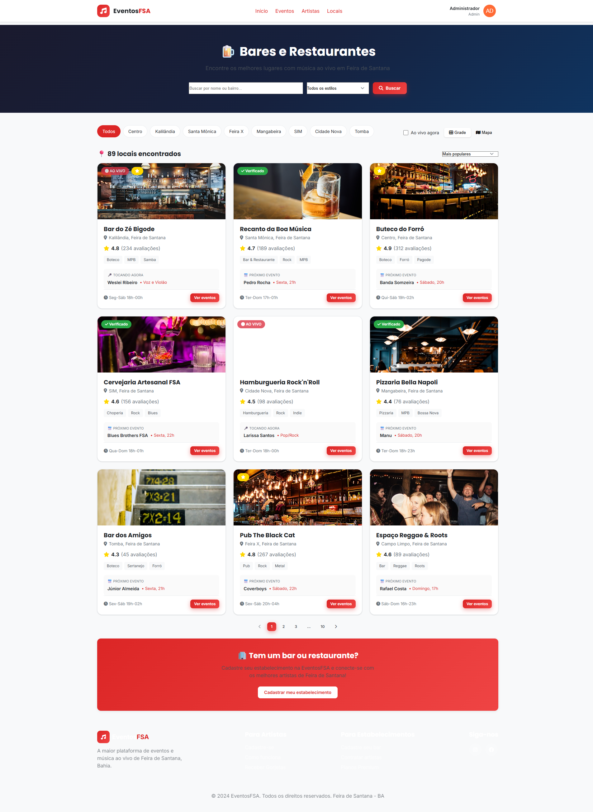
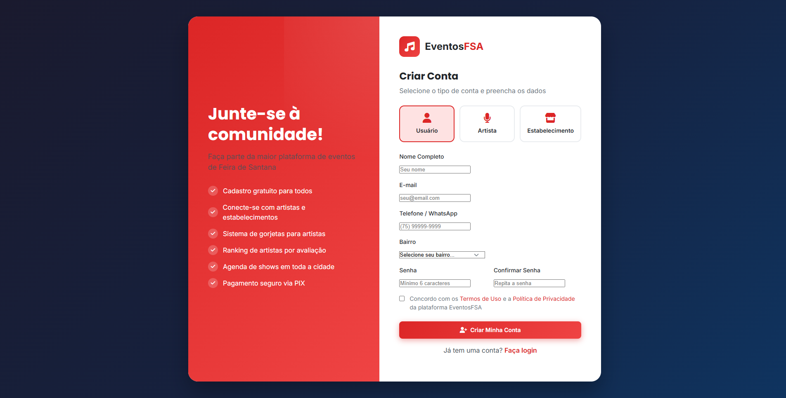
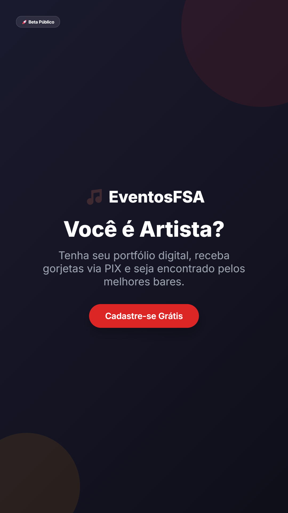
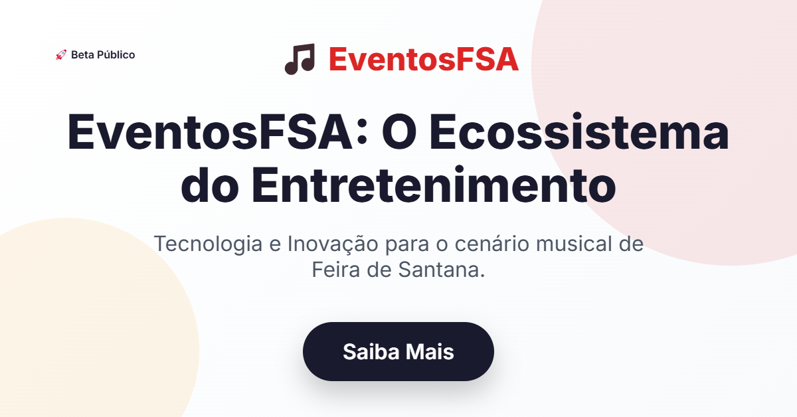
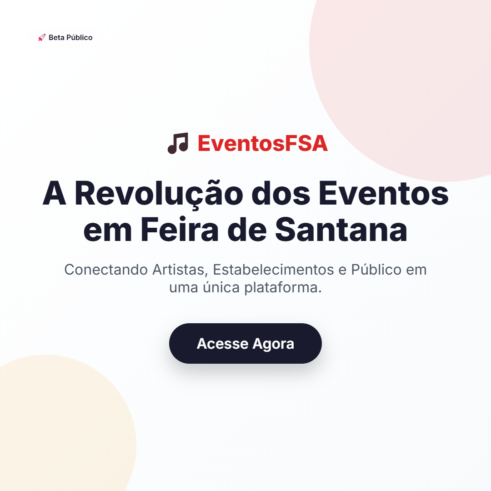

<div align="center">

# 🎵 EventosFSA - Pack Completo para Investidor


### 📊 Material Completo de Apresentação para Carlos

**Tudo que você precisa para apresentar o EventosFSA a investidores, parceiros e stakeholders.**

[📕 **Books em PDF**](#-os-5-books) • [📸 **Screenshots**](#-galeria-de-screenshots) • [📋 **Índice Master**](INDICE-MASTER.md)

</div>

---

## 👋 Olá, Carlos!

Este é o seu **kit completo de apresentação** do EventosFSA. Aqui você encontra todos os materiais necessários para:

- ✅ Apresentar o projeto a **investidores**
- ✅ Convencer **donos de bares** a entrarem na plataforma
- ✅ Recrutar **artistas** para o catálogo
- ✅ Explicar a **visão técnica** para parceiros

---

## 📚 Os 5 Books

Preparamos **5 documentos profissionais** que cobrem todos os aspectos do negócio:

<div align="center">

| # | 📘 Book | 👤 Público | ⏱️ Leitura | 🔗 Link |
|:-:|:--------|:-----------|:----------:|:--------|
| 1 | **Visão Geral** | Qualquer um | 10 min | [📖 Ler](books/01-visao-geral/book.md) |
| 2 | **Guia Estabelecimentos** | Donos de bares | 10 min | [📖 Ler](books/02-guia-estabelecimentos/book.md) |
| 3 | **Guia Artistas** | Músicos e bandas | 10 min | [📖 Ler](books/03-guia-artistas/book.md) |
| 4 | **Infraestrutura QR Code** | Técnicos | 8 min | [📖 Ler](books/04-infraestrutura-qrcode/book.md) |
| 5 | **Modelo de Negócio** | Investidores | 15 min | [📖 Ler](books/05-modelo-negocio/book.md) |

</div>

### 🎯 Ordem Recomendada de Leitura

Para cada tipo de apresentação:

**🤝 Reunião com Investidor:**
```
1️⃣ Visão Geral → 2️⃣ Modelo de Negócio → 3️⃣ Screenshots do Admin
```

**🍺 Prospecção de Bar/Restaurante:**
```
1️⃣ Guia Estabelecimentos → 2️⃣ Screenshot Portal QR → 3️⃣ Demonstração ao vivo
```

**🎤 Recrutando Artistas:**
```
1️⃣ Guia Artistas → 2️⃣ Dashboard do Artista → 3️⃣ Falar sobre gorjetas
```

---

## 📸 Galeria de Screenshots

Todas as telas do sistema capturadas em alta qualidade:

### 🌐 Interfaces Públicas

| Screenshot | Descrição |
|:-----------|:----------|
|  | **Homepage** - Página inicial com eventos em destaque, artistas populares e bares ao vivo |
|  | **Eventos** - Lista completa com filtros por data, bairro e estilo musical |
|  | **Artistas** - Catálogo com ranking, avaliações e sistema de gorjetas |
|  | **Estabelecimentos** - Bares com badge "Ao Vivo" quando tem música rolando |

### 🔐 Autenticação

| Screenshot | Descrição |
|:-----------|:----------|
|  | **Login** - Acesso com email, redes sociais ou modo demo |
|  | **Cadastro** - Formulário inteligente por tipo de usuário |

### 📊 Dashboards

| Screenshot | Descrição |
|:-----------|:----------|
|  | **Admin** - Métricas globais, aprovações, financeiro |
|  | **Artista** - Agenda, propostas, gorjetas, ranking |
|  | **Estabelecimento** - Eventos, artistas favoritos, avaliações |

### 🌟 Diferenciais

| Screenshot | Descrição |
|:-----------|:----------|
|  | **Perfil do Artista** - Página pública completa com galeria, vídeos e repertório |
|  | **Portal QR Code** - O que o cliente vê ao escanear no bar! |

---

## � Assets de Marketing

Imagens prontas para divulgação nas redes sociais:

<div align="center">

| 📱 Instagram Story | 🟦 LinkedIn Banner | 🟥 Feed Quadrado |
|:---:|:---:|:---:|
|  |  |  |

</div>

> **💡 Dica:** Use estas imagens para anunciar o lançamento ou recrutar artistas no WhatsApp/Instagram.

---

## �🎯 O Pitch em 30 Segundos

> 🎤 *"O EventosFSA é a plataforma que conecta artistas, bares e público de Feira de Santana. Resolvemos a dor dos músicos que não conseguem shows, dos bares que gerenciam agenda no WhatsApp, e do público que não sabe onde tem evento. Nossa tecnologia de QR Code permite gorjetas via PIX direto para o artista, aumentando o cachê em até 30%. Cobramos 5% de comissão sobre cachês e temos planos premium. Com 50 estabelecimentos ativos, projetamos R$ 11.000/mês de receita recorrente."*

---

## 💰 Números que Importam

<div align="center">

| Métrica | Valor |
|:--------|:-----:|
| 📍 Mercado (Feira de Santana) | 600.000 habitantes |
| 🍺 Bares/Restaurantes ativos | +500 |
| 🎤 Músicos profissionais | +2.000 |
| 👥 Público que sai no fds | +100.000 |

</div>

### 💸 Modelo de Receita

```
┌─────────────────────────────────────────────────────┐
│               FONTES DE RECEITA                     │
├─────────────────────────────────────────────────────┤
│                                                     │
│   💼 Comissão sobre cachês         5%               │
│   ⭐ Plano Premium Artista         R$ 29,90/mês     │
│   🏢 Plano Premium Estabelecimento R$ 49,90/mês     │
│   💝 Taxa sobre gorjetas           0% (grátis!)     │
│                                                     │
└─────────────────────────────────────────────────────┘
```

### 📈 Projeção de Receita

| Mês | Estabelecimentos | Eventos/mês | Receita |
|:---:|:----------------:|:-----------:|:-------:|
| 3 | 20 | 160 | R$ 3.200 |
| 6 | 50 | 400 | R$ 11.000 |
| 12 | 150 | 1.200 | R$ 35.000 |

---

## 🚀 Próximos Passos para Carlos

### 1. Validar o Conceito
- [ ] Conversar com 5 donos de bar conhecidos
- [ ] Perguntar se usariam a plataforma
- [ ] Entender quanto pagam hoje em cachês

### 2. Recrutar Artistas
- [ ] Identificar 10 artistas ativos em FSA
- [ ] Mostrar o Guia do Artista
- [ ] Cadastrar como "Pioneiros"

### 3. Fechar Primeiro Bar
- [ ] Escolher um bar parceiro para piloto
- [ ] Instalar QR Code nas mesas
- [ ] Acompanhar primeiro evento

### 4. Decisão de Investimento
- [ ] Analisar Book 5 (Modelo de Negócio)
- [ ] Definir quanto quer investir
- [ ] Conversar com Deivison sobre roadmap

---

## 📁 Estrutura desta Pasta

```
Primeira-Perspectiva/
│
├── 📄 README.md                    ← VOCÊ ESTÁ AQUI
├── 📄 INDICE-MASTER.md             ← Navegação completa
│
├── 📁 books/                       ← 5 Books completos
│   ├── 01-visao-geral/
│   ├── 02-guia-estabelecimentos/
│   ├── 03-guia-artistas/
│   ├── 04-infraestrutura-qrcode/
│   └── 05-modelo-negocio/
│
├── 📁 screenshots/                 ← 13 imagens do sistema
│   ├── 01-homepage.png
│   ├── 02-login.png
│   ├── ...
│   └── 11-portal-qrcode.png
│
├── 📁 marketing/                   ← 🎨 Assets para redes sociais
│   ├── 01-feed-launch.png
│   ├── 02-story-artista.png
│   └── 03-linkedin-banner.png
│
├── 📁 assets/                      ← Logos e materiais
└── 📁 pdf-generator/               ← Scripts para gerar PDFs
```

---

## 👥 Equipe do Projeto

<div align="center">

| Papel | Nome | Responsabilidade |
|:------|:-----|:-----------------|
| 💼 **Idealizador** | Carlos | Visão de negócio, networking, investimento |
| 💻 **Desenvolvedor** | Deivison Santana | Arquitetura, código, deploy |

</div>

### 📞 Contato

<div align="center">

[_9150--1680-25D366?style=for-the-badge&logo=whatsapp&logoColor=white)](https://wa.me/557591501680)

</div>

---

## ❓ FAQ para Apresentações

**"Quanto custa para o bar?"**
> Apenas 5% sobre os cachês pagos via plataforma. Sem mensalidade obrigatória.

**"O artista paga alguma coisa?"**
> Não! Cadastro gratuito. Existe plano premium opcional por R$ 29,90/mês.

**"Como funcionam as gorjetas?"**
> 100% vai para o artista, via PIX. Sem taxa nossa.

**"Já está funcionando?"**
> Estamos em Beta Público. O site está online e funcional. Estamos captando os primeiros usuários.

**"Qual o investimento necessário?"**
> ~R$ 15.000 para MVP completo + 3 meses de operação.

---

<div align="center">

### 🎵 *Alavancar os eventos de Feira de Santana* 🎵

**Este material foi preparado especialmente para você, Carlos!**

*Qualquer dúvida, é só chamar no WhatsApp.*

[](.)

</div>
