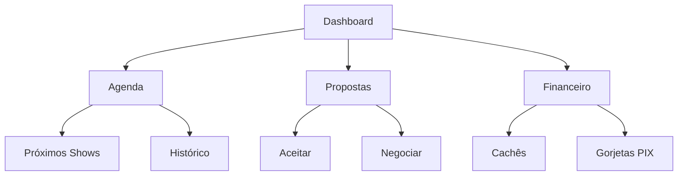

# 🎤 O Palco é Seu: Guia do Artista EventosFSA

  

## 🚀 Introdução
Bem-vindo ao **EventosFSA**, a plataforma que vai transformar sua carreira musical em Feira de Santana. Chega de depender apenas do boca-a-boca. Aqui, seu talento é vitrine para centenas de contratantes.

---

## 💡 Por que o EventosFSA?

### 1. Visibilidade Profissional
Seu perfil não é apenas uma lista de músicas. É seu portfólio vivo.
- **Fotos em Alta Resolução**
- **Vídeos de Performances**
- **Agenda Atualizada**

### 2. Receba Gorjetas Digitais (PIX)
O público amou seu show? Eles podem te enviar um PIX direto pelo app, sem taxas, na hora.
> "Aumente seu cachê em até 30% com gorjetas digitais."

### 3. Contratos Simplificados
Receba propostas de bares e restaurantes diretamente no seu painel. Negocie valores, datas e horários com segurança.

---

## 📊 O Painel do Artista

---

## 📱 Como Funciona o QR Code no Show?

1. **O Bar imprime seu QR Code** e coloca nas mesas.
2. **O Cliente escaneia** e vê seu perfil "Tocando Agora".
3. **O Cliente pede música** ou envia uma gorjeta.
4. **Você recebe a notificação** e o dinheiro cai na conta.

---

## 🚀 Comece Agora
Cadastre-se gratuitamente no Beta Público e garanta seu selo de **Artista Pioneiro**.

[Quero me Cadastrar](https://wa.me/5575981231019?text=Sou%20Artista%20e%20quero%20entrar%20no%20Beta!)
