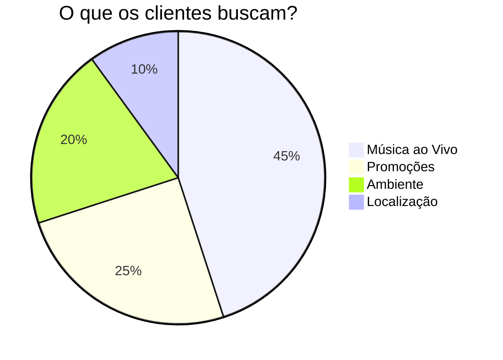

# 🍺 Casa Cheia: Guia do Estabelecimento EventosFSA

  

## 🚀 Transforme seu Bar em Palco
O **EventosFSA** não é apenas uma agenda. É uma ferramenta de gestão de entretenimento para seu bar, restaurante ou casa de show.

---

## 💡 Benefícios Reais

### 1. Encontre o Artista Certo
Pare de procurar no Instagram. Filtre por:
- **Estilo Musical** (Sertanejo, Rock, MPB...)
- **Avaliação do Público**
- **Faixa de Preço**

### 2. Agenda Automatizada
Organize sua programação mensal em minutos. O sistema evita conflitos e notifica os artistas automaticamente.

### 3. Atraia Mais Clientes
Seu evento aparece na página inicial do app para milhares de usuários em Feira de Santana.
> "Bares com agenda online têm 40% mais movimento em dias de show."

---

## 📱 A Experiência do Cliente (Portal QR Code)

Imagine seu cliente chegando na mesa e encontrando um QR Code. Ao escanear:

1. **Vê quem está tocando** (foto, bio, estilo).
2. **Vê o cardápio musical** (setlist).
3. **Vê a agenda futura** do seu bar.
4. **Envia gorjeta** para o artista (você não paga nada por isso e o artista sai feliz).

---

## 📊 Gestão Inteligente

---

## 🚀 Seja um Parceiro Beta
Cadastre seu estabelecimento agora e ganhe 3 meses de destaque na plataforma.

[Cadastrar Meu Bar](https://wa.me/5575981231019?text=Tenho%20um%20Bar%20e%20quero%20entrar%20no%20Beta!)
