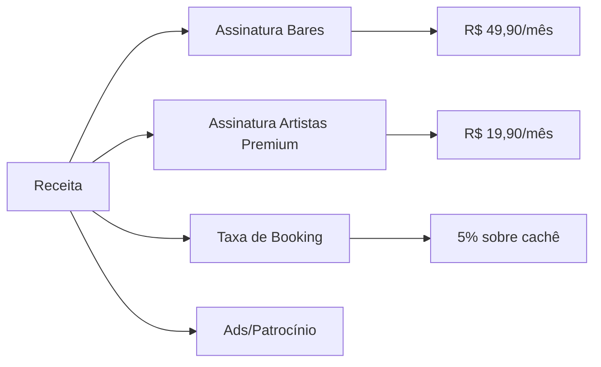

# 💼 O Ecossistema: Visão para Investidores

  

## 🚀 Executive Summary
O **EventosFSA** é uma plataforma SaaS (Software as a Service) B2B2C que resolve a fragmentação do mercado de entretenimento local em cidades de médio porte, começando por Feira de Santana (600k habitantes).

---

## 💡 O Problema
1. **Artistas:** Dificuldade de venda de shows e profissionalização.
2. **Bares:** Gestão de agenda amadora (WhatsApp/Papel) e dificuldade de encontrar novos talentos.
3. **Público:** Informação descentralizada (Instagram Stories que somem).

## 💰 Modelo de Negócio (Monetização)

---

## 📈 Potencial de Mercado (Feira de Santana)
- **+500** Bares e Restaurantes ativos.
- **+2.000** Músicos e profissionais da música.
- **+100.000** Pessoas economicamente ativas buscando lazer fds.

## 🗺️ Roadmap de Expansão
1. **Fase 1 (Atual):** Validação em Feira de Santana (Beta Público).
2. **Fase 2:** Expansão para Salvador e Região Metropolitana.
3. **Fase 3:** Franquia do modelo para outras cidades do Nordeste.

---

## 🚀 Junte-se a Nós
Estamos buscando parceiros estratégicos para acelerar o go-to-market.

[Falar com Fundador](https://wa.me/5575981231019?text=Sou%20Investidor%20e%20quero%20conhecer%20o%20projeto!)
